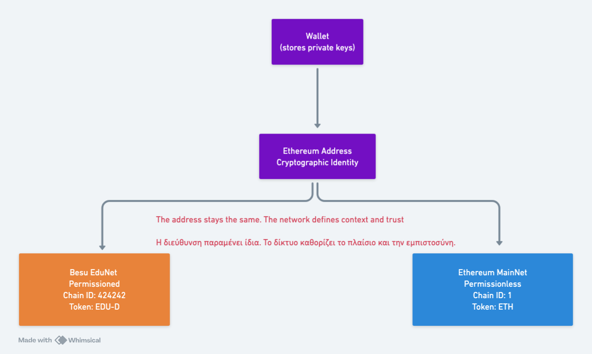

# Lab 01 — Wallets & Web3 Identity (Besu Edu‑Net)

🎓 Part of **Web3Edu Labs**  
🌐 Lab landing page: https://web3edu.dimikog.org/#/labs/wallets-keys

---

## 🇬🇧 English

## Learning Objectives
By completing this lab, you will be able to:
- Explain how **wallets and addresses** form the basis of Web3 identity
- Understand the role of a **wallet** in a **permissioned blockchain**
- Describe how identity exists **before** transactions or smart contracts
- Recognize the **existence of cryptographic keys** without managing them directly

---

## Context & Concepts

**Identity in Web3 is cryptographic and network‑agnostic — but trust is defined by the network you join.**

In this lab, you explore how wallets, cryptographic keys, and addresses form the basis of identity in a permissioned Ethereum network based on **Hyperledger Besu**.



**The address stays the same. The network defines context and trust.**

Traditional systems rely on accounts and passwords.  
Web3 systems rely on:
- cryptographic key pairs
- locally controlled wallets
- network‑level trust

🔎 **Scope note**

In this lab, cryptographic keys (private/public) are treated at a **conceptual level only**.
You are **not expected to generate, export, or manage keys**.

A dedicated follow‑up lab will focus exclusively on:
- private vs public keys
- key generation and storage
- security implications and key loss

A wallet is:

> A local cryptographic tool that manages keys and signs messages for a specific blockchain network.

---

## Prerequisites
- Modern web browser (Chrome / Firefox / Brave)
- Browser wallet (MetaMask or equivalent)
- Besu Edu‑Net RPC details (provided by below)

### Besu Edu‑Net (MetaMask Configuration)

Network Name: Besu Edu‑Net  
RPC URL: https://rpc.dimikog.org/rpc  
Chain ID: 424242  
Currency Symbol: EDU-D  
Block Explorer: https://blockexplorer.dimikog.org

### Environment
- **Network:** Besu Edu‑Net (permissioned QBFT)
- **Transactions:** Not required
- **Gas:** Not required

---

## Tools Used
This lab uses a set of standalone, read‑only Web3Edu lab tools:

- **Network Identifier** — Detects the active `chainId` and network context  
  https://dimikog.github.io/web3edu-lab-tools/tools/network-identifier/app/

- **Address Anatomy** — Visual inspection of Ethereum address structure  
  https://dimikog.github.io/web3edu-lab-tools/tools/address-anatomy/app/

- **Identity Scope Visualizer** — Same address, different network meaning  
  https://dimikog.github.io/web3edu-lab-tools/tools/identity-scope/app/

---
 ## Step-by-Step Instructions

### Step 1 — Configure your wallet for Besu Edu-Net

1. Open your browser wallet (e.g. MetaMask).
2. Navigate to **Settings → Networks → Add Network**.
3. Enter the Besu Edu-Net parameters provided above.
4. Save and switch to the new network.

🔎 Mandatory verification:  
Open the **Network Identifier** tool:  
👉 https://dimikog.github.io/web3edu-lab-tools/tools/network-identifier/app/

⚠️ If the detected network does not match Besu Edu‑Net, do not proceed.

✅ Expected outcome:  
Your wallet is connected to Besu Edu-Net and the network is correctly identified.

---

### Step 2 — Create or select a wallet account

1. Create a new account in your wallet **or** select an existing one.
2. Copy your **public address** (starts with `0x…`).

⚠️ No transactions are required at this stage.

✅ Expected outcome:  
You have a public address that represents your Web3 identity on Besu Edu-Net.

---

### Step 3 — Inspect your address structure

1. Open the **Address Anatomy** tool:  
   👉 https://dimikog.github.io/web3edu-lab-tools/tools/address-anatomy/app/
2. Paste your public address into the input field.
3. Observe:
   - the `0x` prefix
   - the total length (42 characters)
   - the checksum casing (mixed upper/lower case)

✅ Expected outcome:  
You can visually recognize and explain the structure of an Ethereum address.

---

### Step 4 — Understand the key relationship (conceptual)

At this stage, you only need to understand the **existence and role** of keys.

```
Private Key  →  Public Key  →  Address
```

- The derivation is **one-way**
- The wallet manages keys **on your behalf**
- The address represents your identity **on a given network**

⚠️ You are **not expected** to access, export, or manipulate keys in this lab.

📌 Key generation, storage, and security practices are covered in a **separate dedicated lab**.

✅ Expected outcome:  
You can conceptually explain how wallets, keys, and addresses relate without handling keys directly.

---

### Step 5 — Identity across networks

1. Open the **Identity Scope Visualizer** tool:  
   👉 https://dimikog.github.io/web3edu-lab-tools/tools/identity-scope/app/
2. Use the same public address.
3. Compare how the address appears across different networks.

✅ Expected outcome:  
You understand that the **identity (address)** stays the same, while **meaning and trust** are defined by the network.

---

### Step 6 — Identity without accounts

Reflect on the following:
- You did not create a username
- You did not register an account
- You did not provide personal data

Yet, you already possess a valid Web3 identity.

✅ Expected outcome:  
You can explain how Web3 identity exists independently of centralized account systems.

---

## Exercises
Complete the following:

1. Identify your public address on Besu Edu‑Net
2. Explain how the same address can exist on multiple networks
3. Describe what information defines identity at this stage

---

## Reflection Questions
- Why does Web3 identity not require accounts?
- What happens if a private key is leaked?
- Why do we use a permissioned Besu network in this lab?

---

## Lab Completion

🎯 You have completed **Lab 01 — Wallets & Web3 Identity**.

Return to **Web3Edu** to:
- mark the lab as completed
- update your learning profile
- unlock the next lab

👉 https://web3edu.dimikog.org/#/labs/wallets-keys

---

## 🇬🇷 Ελληνικά

## Μαθησιακοί Στόχοι
Με την ολοκλήρωση του εργαστηρίου θα μπορείτε:
- Να εξηγείτε πώς **πορτοφόλια και διευθύνσεις** αποτελούν τη βάση της ταυτότητας στο Web3
- Να κατανοείτε τον ρόλο του **πορτοφολιού** σε ένα **αδειοδοτημένο blockchain**
- Να εξηγείτε πώς η ταυτότητα υπάρχει **πριν** από συναλλαγές ή smart contracts
- Να αναγνωρίζετε την **ύπαρξη κρυπτογραφικών κλειδιών** χωρίς να τα διαχειρίζεστε άμεσα

---

## Εννοιολογικό Υπόβαθρο

**Η ταυτότητα στο Web3 είναι κρυπτογραφική και ανεξάρτητη δικτύου — η εμπιστοσύνη όμως καθορίζεται από το δίκτυο στο οποίο συμμετέχετε.**

Σε αυτό το εργαστήριο εξετάζετε πώς πορτοφόλια, κρυπτογραφικά κλειδιά και διευθύνσεις αποτελούν τη βάση της ταυτότητας σε ένα αδειοδοτημένο Ethereum δίκτυο βασισμένο σε **Hyperledger Besu**.


**Η διεύθυνση παραμένει ίδια. Το δίκτυο καθορίζει το πλαίσιο και την εμπιστοσύνη.**

Παραδοσιακά συστήματα βασίζονται σε λογαριασμούς και κωδικούς.  
Τα Web3 συστήματα βασίζονται σε:
- ζεύγη κρυπτογραφικών κλειδιών
- τοπικά ελεγχόμενα πορτοφόλια
- εμπιστοσύνη που ορίζεται από το δίκτυο

🔎 **Σημείωση**

Σε αυτό το lab, τα κρυπτογραφικά κλειδιά (ιδιωτικό / δημόσιο) εξετάζονται
**μόνο σε εννοιολογικό επίπεδο**.

**Δεν απαιτείται** να δημιουργήσετε, να εξάγετε ή να διαχειριστείτε κλειδιά.

Ένα επόμενο, ξεχωριστό lab θα καλύψει αναλυτικά:
- ιδιωτικό vs δημόσιο κλειδί
- δημιουργία και αποθήκευση κλειδιών
- επιπτώσεις ασφάλειας και απώλειας κλειδιών

Το πορτοφόλι είναι:

> Ένα τοπικό κρυπτογραφικό εργαλείο που διαχειρίζεται κλειδιά και υπογράφει μηνύματα για ένα συγκεκριμένο blockchain δίκτυο.

---

## Προαπαιτούμενα
- Σύγχρονος browser (Chrome / Firefox / Brave)
- Πορτοφόλι browser (π.χ. MetaMask)
- Στοιχεία RPC για το Besu Edu‑Net (βλ. παρακάτω)

### Ρύθμιση Besu Edu‑Net (MetaMask)

Όνομα Δικτύου: Besu Edu‑Net  
RPC URL: https://rpc.dimikog.org/rpc  
Chain ID: 424242  
Νόμισμα: EDU-D  
Block Explorer: https://blockexplorer.dimikog.org

### Περιβάλλον
- **Δίκτυο:** Besu Edu‑Net (permissioned QBFT)
- **Συναλλαγές:** Δεν απαιτούνται
- **Gas:** Δεν απαιτείται

---

## Εργαλεία που Χρησιμοποιούνται
Το εργαστήριο χρησιμοποιεί αυτόνομα, read‑only εργαλεία Web3Edu:

- **Network Identifier** — Εντοπίζει το ενεργό `chainId` και το πλαίσιο δικτύου  
  https://dimikog.github.io/web3edu-lab-tools/tools/network-identifier/app/index.gr.html

- **Address Anatomy** — Οπτική ανάλυση της δομής διεύθυνσης Ethereum  
  https://dimikog.github.io/web3edu-lab-tools/tools/address-anatomy/app/index.gr.html

- **Identity Scope Visualizer** — Ίδια διεύθυνση, διαφορετικό νόημα ανά δίκτυο  
  https://dimikog.github.io/web3edu-lab-tools/tools/identity-scope/app/index.gr.html

---

## Βήματα Εργαστηρίου

### Βήμα 1 — Ρύθμιση πορτοφολιού για Besu Edu-Net

1. Ανοίξτε το πορτοφόλι browser (π.χ. MetaMask).
2. Μεταβείτε στις **Ρυθμίσεις → Δίκτυα → Προσθήκη Δικτύου**.
3. Συμπληρώστε τις παραμέτρους του Besu Edu-Net που σας δόθηκαν.
4. Αποθηκεύστε και επιλέξτε το νέο δίκτυο.

🔎 Υποχρεωτικός έλεγχος:  
Ανοίξτε το εργαλείο **Network Identifier**:  
👉 https://dimikog.github.io/web3edu-lab-tools/tools/network-identifier/app/index.gr.html

⚠️ Αν το δίκτυο δεν αντιστοιχεί στο Besu Edu‑Net, μην συνεχίσετε το εργαστήριο.

✅ Αναμενόμενο αποτέλεσμα:  
Το πορτοφόλι σας είναι συνδεδεμένο στο Besu Edu-Net και το δίκτυο αναγνωρίζεται σωστά.

---

### Βήμα 2 — Δημιουργία ή επιλογή λογαριασμού

1. Δημιουργήστε έναν νέο λογαριασμό στο πορτοφόλι σας **ή** επιλέξτε έναν υπάρχοντα.
2. Αντιγράψτε τη **δημόσια διεύθυνσή** σας (ξεκινά με `0x…`).

⚠️ Σε αυτό το στάδιο **δεν απαιτείται** καμία συναλλαγή.

✅ Αναμενόμενο αποτέλεσμα:  
Διαθέτετε μια δημόσια διεύθυνση που εκφράζει την Web3 ταυτότητά σας στο Besu Edu-Net.

---

### Βήμα 3 — Παρατήρηση δομής διεύθυνσης

1. Ανοίξτε το εργαλείο **Address Anatomy**:  
   👉 https://dimikog.github.io/web3edu-lab-tools/tools/address-anatomy/app/index.gr.html
2. Επικολλήστε τη δημόσια διεύθυνση στο πεδίο εισαγωγής.
3. Παρατηρήστε:
   - το πρόθεμα `0x`
   - το συνολικό μήκος (42 χαρακτήρες)
   - το checksum (μίξη κεφαλαίων / πεζών)

✅ Αναμενόμενο αποτέλεσμα:  
Μπορείτε να αναγνωρίσετε οπτικά τη δομή μιας διεύθυνσης Ethereum.

---

### Βήμα 4 — Κατανόηση σχέσης κλειδιών (εννοιολογικά)

Σε αυτό το στάδιο, αρκεί να κατανοήσετε **την ύπαρξη και τον ρόλο** των κλειδιών.

```
Ιδιωτικό Κλειδί  →  Δημόσιο Κλειδί  →  Διεύθυνση
```

- Η παραγωγή είναι **μονόδρομη**
- Το πορτοφόλι διαχειρίζεται τα κλειδιά **εκ μέρους σας**
- Η διεύθυνση εκφράζει την ταυτότητά σας **σε συγκεκριμένο δίκτυο**

⚠️ Δεν απαιτείται να αποκτήσετε πρόσβαση, να εξάγετε ή να χειριστείτε κλειδιά σε αυτό το lab.

📌 Η διαχείριση και η ασφάλεια κλειδιών καλύπτονται σε **ξεχωριστό, αφιερωμένο lab**.

✅ Αναμενόμενο αποτέλεσμα:  
Μπορείτε να εξηγήσετε εννοιολογικά τη σχέση πορτοφολιού–κλειδιών–διεύθυνσης.

---

### Βήμα 5 — Ταυτότητα ανά δίκτυο

1. Ανοίξτε το εργαλείο **Identity Scope Visualizer**:  
   👉 https://dimikog.github.io/web3edu-lab-tools/tools/identity-scope/app/index.gr.html
2. Χρησιμοποιήστε την ίδια δημόσια διεύθυνση.
3. Συγκρίνετε πώς εμφανίζεται η διεύθυνση σε διαφορετικά δίκτυα.

✅ Αναμενόμενο αποτέλεσμα:  
Κατανοείτε ότι η **ταυτότητα (διεύθυνση)** παραμένει σταθερή, ενώ το **νόημα και η εμπιστοσύνη** ορίζονται από το δίκτυο.

---

### Βήμα 6 — Ταυτότητα χωρίς λογαριασμούς

Σκεφτείτε τα εξής:
- Δεν δημιουργήσατε username
- Δεν κάνατε εγγραφή
- Δεν δώσατε προσωπικά δεδομένα

Κι όμως, διαθέτετε ήδη έγκυρη Web3 ταυτότητα.

✅ Αναμενόμενο αποτέλεσμα:  
Μπορείτε να εξηγήσετε πώς η Web3 ταυτότητα υπάρχει ανεξάρτητα από κεντρικοποιημένα συστήματα λογαριασμών.
---

## Ασκήσεις
Ολοκληρώστε τα παρακάτω:

1. Εντοπίστε τη δημόσια διεύθυνσή σας στο Besu Edu‑Net
2. Εξηγήστε πώς η ίδια διεύθυνση μπορεί να υπάρχει σε πολλά δίκτυα
3. Περιγράψτε ποια πληροφορία ορίζει την ταυτότητα σε αυτό το στάδιο

---

## Ερωτήσεις Αναστοχασμού
- Γιατί η ταυτότητα στο Web3 δεν χρειάζεται λογαριασμούς;
- Τι συμβαίνει αν διαρρεύσει το ιδιωτικό κλειδί;
- Γιατί χρησιμοποιούμε permissioned Besu δίκτυο σε αυτό το lab;

---

## Ολοκλήρωση Εργαστηρίου

🎯 Ολοκληρώσατε το **Lab 01 — Wallets & Web3 Identity**.

Επιστρέψτε στο **Web3Edu** για να:
- δηλώσετε την ολοκλήρωση του εργαστηρίου
- ενημερώσετε το μαθησιακό σας προφίλ
- ξεκλειδώσετε το επόμενο εργαστήριο

👉 https://web3edu.dimikog.org/#/labs/wallets-keys

---

© Web3Edu
